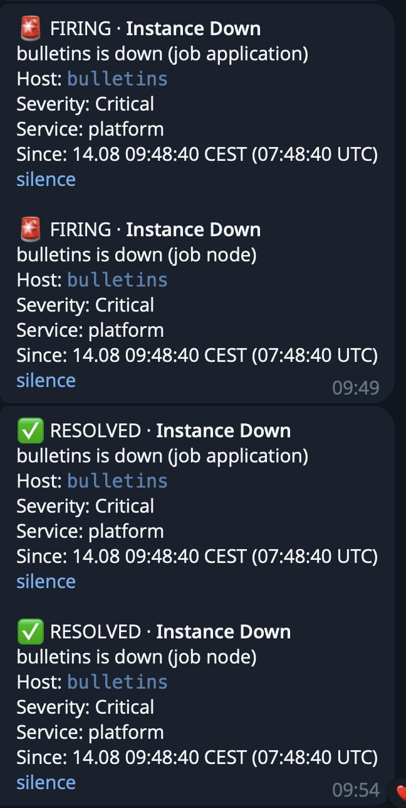

### Hexlet tests and linter status:

[](https://github.com/StepanenkoArtem/devops-engineer-from-scratch-project-318/actions)

## Overview

Two DigitalOcean droplets in a shared VPC:

| Inventory host | Role                             | Public IP         | VPC (private) IP | SSH user |
| -------------- | -------------------------------- | ----------------- | ---------------- | -------- |
| `bulletins`    | application + nginx/TLS          | `165.232.125.175` | `10.114.0.2`     | `devops` |
| `grafana`      | Prometheus + Grafana + nginx/TLS | `165.227.174.50`  | `10.114.0.3`     | `admin`  |

Hosts are addressed in the inventory by **logical alias**, with the IP in `ansible_host` — so a rebuilt droplet only
needs one line changed, and `host_vars/<alias>.yml` never has to be renamed.

Metrics scraping goes over the **private VPC network** — no exporter is reachable from the public internet. SSH is on
port `23332`, key-based, root login and password auth disabled (see bootstrap).

Two public HTTPS endpoints, each nginx + Let's Encrypt on its own host:

| URL                             | What                                     |
| ------------------------------- | ---------------------------------------- |
| **https://bulletins.artem.diy** | the application                          |
| **https://grafana.artem.diy**   | Grafana UI (dashboards) — login required |

## Playbooks & Make targets

| Playbook          | Runs on       | Make target                        | Purpose                                 |
| ----------------- | ------------- | ---------------------------------- | --------------------------------------- |
| `droplets.yml`    | any droplet   | `make droplet HOST=<host>`         | one-shot bootstrap of a fresh droplet   |
| `application.yml` | `application` | `make application IMAGE_TAG=sha-…` | deploy the app (nginx, TLS, container)  |
| `monitoring.yml`  | `monitoring`  | `make monitoring`                  | deploy Prometheus + Grafana (nginx/TLS) |

Install dependencies (Ansible roles + collections + Python deps) once:

```sh
make requirements
```

## Server bootstrap (Ansible)

`ansible/droplets.yml` is a **one-shot** playbook: it takes a fresh droplet (root SSH login open on port 22) and
transitions it to a hardened state — a non-root user with key-based access, SSH moved to a custom port, root and
password authentication disabled, and UFW enabled with a default-deny inbound policy.

Run it **once** per droplet, right after creation/reset, targeting a single host:

```sh
make droplet HOST=application    # or: HOST=monitoring
```

Because the playbook itself closes root@22, re-running it will fail at connection time — that is expected, not a bug.
Ongoing, repeatable configuration lives in the per-role playbooks (`application.yml`, `monitoring.yml`), which connect
as the non-root user on the configured port.

## Application deploy

Deploy a specific image. The play **requires** `image_tag` — an immutable `sha-<commit>` tag (per ADR-0001; there is no
`latest` default, and the play fails fast if the tag is missing):

```sh
make application IMAGE_TAG=sha-<commit>
```

It sets up nginx + a Let's Encrypt TLS certificate, installs node_exporter and the nginx exporter, and deploys the app
container. The vault password file path is set in
`ansible.cfg` (`vault_password_file`), so no `--vault-password-file` flag is needed — just make sure that file exists
locally.

## Monitoring — Prometheus

`ansible/monitoring.yml` deploys Prometheus on the `monitoring` droplet as a Docker container:

- own Docker network `monitoring` (for the future stack — Grafana/Alertmanager);
- **config** as a host bind-mount `/etc/prometheus/prometheus.yml` (rendered from
  `roles/prometheus/templates/prometheus.yml.j2` and **validated with `promtool`** before it is applied — a bad config
  never reaches the running server);
- **data** as a named volume `prometheus-data` → `/prometheus` (survives container recreation);
- published on **`127.0.0.1:9090` only** — Prometheus is internal and stays that way; the public-facing UI is
  **Grafana** (see below). On config change the container is reloaded via `SIGHUP`.

### Scrape targets

All targets are scraped over the **private VPC network**; none is publicly reachable. The list is **generated from the
Ansible inventory** (`prometheus.yml.j2` iterates `groups`/`hostvars`), so adding a droplet to the inventory
automatically adds it as a `node` target — no manual edit of the Prometheus config.

| Job           | Target(s)         | Added labels                         | Path                   | Notes                                |
| ------------- | ----------------- | ------------------------------------ | ---------------------- | ------------------------------------ |
| `node`        | `10.114.0.2:9100` | `role=application`, `node=bulletins` | `/metrics`             | node_exporter on the app host        |
|               | `10.114.0.3:9100` | `role=monitoring`, `node=grafana`    | `/metrics`             | node_exporter on the monitoring host |
| `application` | `10.114.0.2:9090` | `role=application`, `node=bulletins` | `/actuator/prometheus` | Spring Boot Actuator over VPC        |
| `nginx`       | `10.114.0.2:9113` | `role=application`, `node=bulletins` | `/metrics`             | nginx-prometheus-exporter over VPC   |

All three jobs get the **same** label set on purpose. An asymmetric set is a silent trap: a dashboard variable built from one
job's labels would quietly return nothing for panels querying the other, with no error to notice. Keeping `role` and
`node` on every job also means metrics from the app and from the host under it share a joinable label — `instance`
cannot serve that role, since it includes the port and therefore differs per exporter.

### Access & verification (`up == 1`)

Prometheus listens on loopback only, so reach it through an **SSH tunnel** from your machine:

```sh
ssh -L 9090:localhost:9090 -i ~/.ssh/monitoring -p 23332 admin@165.227.174.50
# then open http://localhost:9090/graph  (or /targets)
```

Verify every target is healthy (`up == 1`) — via the tunnel, or directly on the monitoring host:

```sh
# expect one line per target, all up=1
curl -s 'http://localhost:9090/api/v1/query?query=up' \
  | jq -r '.data.result[] | "\(.metric.job)\t\(.metric.instance)\tup=\(.value[1])"'

# count of healthy targets (expect 4)
curl -s 'http://localhost:9090/api/v1/query?query=count(up==1)' | jq -r '.data.result[0].value[1]'
```

### No alert rules here — on purpose

Prometheus evaluates **no** alerting rules: there is no `rule_files` block and no `/etc/prometheus/rules/`. Everything
lives in Grafana instead (see [Alerting](#alerting)).

The earlier setup did have a Prometheus-side `InstanceDown` rule, and it was removed rather than kept, because it could
never notify anyone: rule evaluation happens in Prometheus but delivery needs **Alertmanager**, which is not deployed.
The rule showed up as `firing` in Prometheus' `/alerts` — and in Grafana's rule list, since Grafana displays
datasource-managed rules read-only — while sending nothing. A rule that looks configured but silently notifies nobody is
worse than no rule.

The trade-off is explicit: Grafana-managed rules are evaluated **by Grafana**, so they stop when Grafana stops. See
[Known limitation](#known-limitation-the-monitoring-cannot-see-its-own-death).

## Monitoring — Grafana

`ansible/monitoring.yml` also deploys Grafana on the `monitoring` droplet, in the same Docker network as Prometheus.

### Access

**https://grafana.artem.diy** — nginx terminates TLS (Let's Encrypt) and reverse-proxies to Grafana, which is published
on **`127.0.0.1:3000` only**. Grafana is never exposed directly.

| Field    | Value                                                                   |
| -------- | ----------------------------------------------------------------------- |
| URL      | https://grafana.artem.diy                                               |
| User     | `admin` (`grafana_admin_user` in `host_vars/grafana.yml`)               |
| Password | `grafana_admin_password` — **encrypted in Ansible Vault**, never in git |

Read the password locally (the vault password file path is already set in `ansible.cfg`):

```sh
ansible-vault view ansible/group_vars/monitoring/vault.yml
```

The password is passed to the container as `GF_SECURITY_ADMIN_PASSWORD`. Note it only takes effect on the **first**
start, when Grafana creates the admin account — afterwards the source of truth is Grafana's own database in the
`grafana-data` volume. To rotate it: `docker exec grafana grafana cli admin reset-admin-password '<new>'`, or remove the
`grafana-data` volume so the first-start path runs again.

Two more container settings exist because Grafana sits behind a proxy: `GF_SERVER_ROOT_URL` (so redirects and links use
the public HTTPS address instead of `localhost:3000`) and `GF_SECURITY_CSRF_TRUSTED_ORIGINS`.

### Provisioning (config as code)

Nothing is configured by hand in the UI — everything arrives from this repository and is mounted **read-only**:

| What                  | Source in repo                                               | Path on host                             |
| --------------------- | ------------------------------------------------------------ | ---------------------------------------- |
| Prometheus datasource | `roles/grafana/templates/datasources/prometheus.yml.j2`      | `/etc/grafana/provisioning/datasources/` |
| Dashboard provider    | `roles/grafana/templates/dashboard_providers/default.yml.j2` | `/etc/grafana/provisioning/dashboards/`  |
| Dashboard JSON        | `roles/grafana/files/dashboards/*.json`                      | `/etc/grafana/dashboards/`               |
| Alert rules           | `roles/grafana/files/alerting/rules.yaml`                    | `/etc/grafana/provisioning/alerting/`    |
| Notification policy   | `roles/grafana/files/alerting/policies.yaml`                 | `/etc/grafana/provisioning/alerting/`    |
| Message template      | `roles/grafana/files/alerting/templates.yaml`                | `/etc/grafana/provisioning/alerting/`    |
| Contact point         | `roles/grafana/templates/alerting/contact_points.yaml.j2`    | `/etc/grafana/provisioning/alerting/`    |

The split between `files/` and `templates/` is not cosmetic. Anything containing a **secret** must go through Jinja, so
it lives in `templates/` as a `.j2`; everything else is copied verbatim from `files/`. That matters here because Go
templating (Grafana) and Jinja (Ansible) both use `{{ }}`: a Go expression inside a `.j2` would be eaten by Jinja. Only
the contact point needs both — the bot token from Vault _and_ a Go expression in its `message` field — so that one file
wraps the Go part in `…`.

Only Grafana's mutable state (its database, plugins) lives in the named volume `grafana-data` → `/var/lib/grafana`.

The datasource is pinned to a **stable `uid: prometheus`**, not an auto-generated one — so dashboard JSON committed here
keeps resolving its datasource on any freshly built host.

### Dashboards

| Dashboard       | UID             | Scope              | Panels                                                                                              |
| --------------- | --------------- | ------------------ | --------------------------------------------------------------------------------------------------- |
| `System Usage`  | `system-usage`  | hosts (node)       | CPU Usage (by mode), CPU Usage (by node), Memory Used, Disk usage by size, Disk usage by filesystem |
| `Bulletins App` | `bulletins-app` | the app (Actuator) + nginx | **Bulletins App** row: Application Uptime, JVM Heap, GC Time, RPS, HTTP Status codes, 5xx Errors Rate · **Nginx** row: Up-times, RPS, Nginx Connection Types |

`System Usage` is driven by a **`node`** variable (`label_values(up, node)`), so it works for any number of hosts
without editing queries; its selectors use `=~` rather than `=`, which keeps them valid when the variable switches
between single- and multi-value.

`Bulletins App` used to have a `job` variable too. It was **removed** when the `Nginx` row was added: the nginx panels
query `job="nginx"`, so a single `job` selector would have driven only half the dashboard — a control that visibly does
nothing for the other half is worse than no control. The panels now pin their job explicitly, which is a positive
matcher and therefore fails loudly (`No data`) if a job is ever renamed. A negative matcher such as `up{job!="node"}`
would keep drawing something after a rename, and would silently absorb every job added later.

The `node` label is added by the Ansible-rendered scrape config, not by Prometheus. It exists because `instance`
identifies an **exporter**, not a machine: `node_exporter` and the app's Actuator on the same host have different
`instance` values (`…:9100` vs `…:9090`), so nothing but a label of our own can say "these two come from the same box".

What each panel is for, where it is not obvious:

| Panel                 | Answers                                                                                 |
| --------------------- | --------------------------------------------------------------------------------------- |
| `Application Uptime`  | is the target scrapeable at all — a state timeline, green `On` / red `Off`              |
| `CPU Usage (by mode)` | _where_ the CPU goes (user/system/iowait/steal), stacked; one node at a time            |
| `CPU Usage (by node)` | _which host_ is busier — one line per node, not stacked                                 |
| `JVM Heap`            | memory-leak watch: after each GC the sawtooth should fall back to the **same** baseline |
| `GC Time`             | `rate(jvm_gc_pause_seconds_sum)` = fraction of wall time spent in GC (≲1% healthy)      |
| `RPS`                 | total throughput, one line                                                              |
| `HTTP Status codes`   | the response mix by code — this is where a single `500` becomes visible                 |
| `5xx Errors Rate`     | 5xx as a **share** of all requests — the number the alert rule thresholds on            |
| `Up-times` (nginx)    | two rows — `nginx_up` and `up{job="nginx"}` — so a failure says _which_ link broke       |
| `RPS` (nginx)         | throughput as the reverse proxy sees it, including requests the app never got            |
| `Nginx Connection Types` | connections split into reading / writing / waiting, stacked; `active` on top as a line |

The two CPU panels answer different questions and cannot be one panel: stacking is only meaningful when the series are
parts of one whole, and CPU modes of _two_ machines are not. `CPU Usage (by mode)` therefore repeats itself per node
(`Repeat by variable: node`) instead of summing them into a misleading 200% axis.

`5xx Errors Rate` computes the ratio in **PromQL**, not via the panel's `100%`-stacking mode. That distinction matters:
an alert rule evaluates the _query_, so anything the renderer computes (stacking, units, transformations) does not exist
for alerting.

Two things worth knowing when reading them:

- `Application Uptime` shows `up`, which means "Prometheus could scrape this target", **not** "the app is healthy". A
  JVM stuck in a GC death spiral still answers scrapes, so heap + GC panels are what cover that blind spot.
- Saturation panels (host CPU/memory/disk, JVM heap) use a fixed `0–100%` axis with an `80%` threshold, so the same
  value always looks the same and small wiggles cannot masquerade as spikes. `GC Time` deliberately keeps an auto axis:
  its healthy range is fractions of a percent, which a fixed `0–100%` scale would flatten into a straight line.
- `JVM Heap` divides by the **sum of heap pool maxima**, which the JVM sizes dynamically and which does **not** equal
  `-Xmx` — hence the `(% of committed)` in its title. The denominator can move, so for alerting prefer absolute heap
  bytes against a fixed `-Xmx`.

### Updating a dashboard

Provisioned dashboards are **read-only in the UI** (`allowUiUpdates: false`), which is deliberate: the file in git is
the source of truth, so a UI edit can never be silently reverted by the next deploy. The loop is:

1. Draft/adjust the dashboard in the UI (as a **new**, non-provisioned copy).
2. **Export → Advanced options → Model: `Classic`**, with _Export for sharing externally_ **off**.
3. In the JSON set `"id": null` and a stable `"uid"`.
4. Save it as `ansible/roles/grafana/files/dashboards/<name>.json` and commit.
5. `make monitoring` — the provider re-reads its directory every 10s, so no container restart is needed.
6. Delete the temporary UI copy, so only the provisioned one remains.

Verify it came from the repo: the dashboard URL is `/d/<uid>/…` and its info tooltip reads **"Managed by: File
provisioning"**.

### Screenshots


`System Usage` with `node = All`, so every panel shows both hosts at once. The URL (`/d/system-usage/…`) and the
"Managed by: File provisioning" badge are the two things worth checking after a deploy — together they prove the
dashboard came from this repository and not from someone's browser session.


`Bulletins App`. The red `Off` band in `Application Uptime` is a deliberate test — the app host was powered off to
confirm the whole chain reacts: the panel turns red, `up` goes to `0`, and the `Instance Down` rule moves to `firing`. A
dashboard that has never been seen failing has not been verified.

## Alerting

Alerting is **Grafana-managed**: Grafana evaluates the rules, groups the results and delivers them. Prometheus holds no
rules and there is no Alertmanager, so there is exactly one place where an alert can be defined and one place where it
can be routed.

All four alerting resources are provisioned from this repository (see the table in
[Provisioning](#provisioning-config-as-code)). Nothing in the chain was configured by hand on the running server.

### The chain

```
alert rule (Grafana)  →  labels + annotations  →  notification policy  →  contact point  →  Telegram
   rules.yaml               rules.yaml              policies.yaml        contact_points…    templates.yaml
```

Four links, four files, and each one can break independently — which is why they are listed separately below.

### Rules

| Rule                  | Folder               | Group / interval | `for` | Severity | service          | Fires when                            |
| --------------------- | -------------------- | ---------------- | ----- | -------- | ---------------- | ------------------------------------- |
| `Instance Down`       | `Node health`        | `Critical` / 30s | 1m    | Critical | `platform`       | `up == 0` for any scrape target       |
| `No metrics`          | `Node health`        | `High` / 5m      | 1m    | Critical | `infrastructure` | `absent(up{job="node"})` — no targets |
| `Memory Used`         | `Node health`        | `High` / 5m      | 10m   | High     | `infrastructure` | used RAM > 80%                        |
| `CPU Usage (by node)` | `Node health`        | `High` / 5m      | 10m   | High     | `infrastructure` | non-idle CPU > 80%                    |
| `Disk usage by size`  | `Node health`        | `High` / 5m      | 5m    | High     | `infrastructure` | used disk > 80%                       |
| `5xx Errors Rate`     | `Application Health` | `Critical` / 1m  | 1m    | Critical | `bulletins`      | 5xx share of requests > 3%            |

Where to see them: **Alerting → Alert rules**, section `Grafana-managed`. Each rule shows `Provisioned`, which is the
proof it came from the repo rather than from the UI.

Three conventions, each with a reason:

- **The evaluation group carries the cadence, the label carries the severity.** They are named after severity
  (`Critical` / `High`) because urgency is what decides how often a check needs to run — but routing reads the
  `Severity` **label**, never the group name. `No metrics` is the case where the two axes disagree: it sits in the
  `High` group (its signal cannot change faster than Prometheus' ~5 min staleness, so evaluating more often is waste)
  while carrying `Severity: Critical` (losing visibility is worse than losing a host).
- **`service` and `Severity` are orthogonal** — "what broke" and "how bad". Together they give a routing matrix; one
  axis alone would not. `Instance Down` is `service: platform` rather than a concrete service because its query (`up`,
  no filter) spans both jobs, and a static label cannot depend on which target went down.
- **`for` is at least two evaluation intervals.** A pending period shorter than the interval collapses to "fire on the
  first breach" and filters nothing — which is a silent way to lose the protection you think you configured.

### Missing metrics ("no data longer than N minutes")

This is handled by per-rule state mapping rather than by a dedicated rule, so it is worth spelling out — it is not
visible in the rule list:

| Failure                                       | What Grafana sees              | Setting               | Result                   |
| --------------------------------------------- | ------------------------------ | --------------------- | ------------------------ |
| exporter/app died                             | `up = 0` (series still exists) | `Instance Down` rule  | normal alert             |
| the target's own metrics stopped              | empty query result             | `noDataState: NoData` | `DatasourceNoData` alert |
| Prometheus unreachable                        | query fails                    | `execErrState: Error` | `DatasourceError` alert  |
| the whole job vanished from the scrape config | nothing at all                 | `No metrics` rule     | normal alert             |

The "N minutes" is not a knob: it is Prometheus' staleness window (~5 min after the last sample) plus the rule's
evaluation interval and `for`.

`No metrics` inverts one convention on purpose: its `noDataState` is **`OK`**, not `NoData`. `absent()` returns a value
only when the series is missing, so an empty result _is_ the healthy state — with the usual setting the rule would sit
in `NoData` permanently and notify constantly. It also only detects a job disappearing **entirely**; one host quietly
dropping out of the inventory is not covered, which is why `Instance Down` exists alongside it.

### Notification channel — Telegram

Chosen because it is free, needs no SMTP relay, and delivers to a phone without an extra app.

Setup procedure, for reproducing it on a fresh bot:

1. Create the bot via [@BotFather](https://t.me/BotFather) → `/newbot`; it returns a token like `<bot_id>:<secret>`.
2. Message the bot once (`/start`) — a bot cannot initiate a conversation, so no `chat_id` exists until you do.
3. Read the chat id from the update:

   ```sh
   read -s TG_TOKEN                                     # paste the token; keeps it out of shell history
   curl -s "https://api.telegram.org/bot$TG_TOKEN/getUpdates" | jq '.result[].message.chat'
   ```

   Updates expire after 24h, so if the result is empty just message the bot again.

4. Store both values in Ansible Vault — never in a plain file:

   ```sh
   ansible-vault edit ansible/group_vars/monitoring/vault.yml
   # tg_bot_token: "<bot_id>:<secret>"
   # tg_chat_id: "<chat_id>"
   ```

5. `make monitoring`. The contact point template renders the token from Vault; the Ansible task runs with `no_log`, so a
   `--diff` run cannot print it.

Diagnosing a rejected send is easier than it looks, because Telegram encodes the token in the **URL path**
(`/bot<TOKEN>/sendMessage`) rather than in a header:

| Response                                     | Cause                              |
| -------------------------------------------- | ---------------------------------- |
| `404 Not Found`                              | bad token (a wrong path, not auth) |
| `400 Bad Request: chat not found`            | bad `chat_id`                      |
| `400 Bad Request: can't parse entities`      | markup broken by the message body  |
| `403 Forbidden: bot was blocked by the user` | the chat exists, you blocked it    |

`parse_mode` is **HTML**, not Markdown, and that is a reliability choice rather than a stylistic one. Metric labels are
full of underscores (`node_exporter`, `http_server_requests_seconds_count`); in Telegram Markdown `_` means italics, so
an odd number of them makes Telegram reject the whole message — the notification does not arrive at all. HTML only
breaks on `<`, `>` and `&`, which practically never appear in labels.

### Message template

`templates.yaml` defines `telegram.message` (Go templating, referenced from the contact point's `message` field). Per
alert it prints status emoji, rule name, severity, the summary, node, service, the start time in both local and UTC, and
links to the dashboard and to a silence.

Both local and UTC are printed on purpose: logs, Prometheus and the DigitalOcean panel are all UTC, and reconciling a
three-hour offset during an incident is exactly the kind of friction worth 20 extra characters.

The 4096-character Telegram limit is a real constraint, not a formality — with a `parse_mode` other than `None`, an
over-long message is **truncated and fails**. That means the worse the incident (more alerts grouped together), the more
likely the notification never arrives. Hence: a few lines per alert, one URL, no `Value: A=1, C=1` diagnostics.

### Notification policy

A single root policy, no child routes — one channel means routing has nothing to decide yet:

| Setting           | Value                         | Effect                                               |
| ----------------- | ----------------------------- | ---------------------------------------------------- |
| `receiver`        | `Telegram`                    | must match the contact point **name** exactly        |
| `group_by`        | `grafana_folder`, `alertname` | one message per rule, all its instances together     |
| `group_wait`      | `30s`                         | delay before the first message of a new group        |
| `group_interval`  | `5m`                          | delay before sending _new_ alerts of an active group |
| `repeat_interval` | `1h`                          | re-notify while the problem is still unresolved      |

`repeat_interval: 1h` is a deliberate reminder, and it is only tolerable because every message carries a `silence` link:
an hourly nudge with no cheap way to say "I know, I'm on it" trains people to ignore the channel.

### Where to look, and how to trigger a test alert

| Question                   | Where                                                             |
| -------------------------- | ----------------------------------------------------------------- |
| what rules exist           | **Alerting → Alert rules** → `Grafana-managed`                    |
| why a rule did/didn't fire | open the rule → **State history** (shows every transition)        |
| what is firing right now   | **Alerting → Active notifications**                               |
| where notifications go     | **Alerting → Notification configuration → Notification policies** |
| the channel itself         | **… → Contact points → `Telegram`**, button `Test`                |

**Channel-only check** (no real alert): `Contact points → Telegram → Test`. It bypasses rules and routing entirely, so a
message here proves the token, chat id and template work — and nothing else.

**Full chain check** — take a scrape target away and wait. Either variant works; they differ in blast radius and in what
the notification looks like:

```sh
# (a) narrow: only host metrics stop. The app keeps serving, so this is the safe one.
ssh -p 23332 devops@165.232.125.175 'sudo systemctl stop node_exporter'
# expect 🚨 FIRING · Instance Down within ~2–3 min
#   (30s evaluation interval + 1m pending + 30s group_wait)
ssh -p 23332 devops@165.232.125.175 'sudo systemctl start node_exporter'
# expect ✅ RESOLVED shortly after
```

```sh
# (b) wide: power the app droplet off from the DigitalOcean panel.
#     All THREE of its targets die (node, application, nginx), so the message carries three alert
#     blocks grouped into a single Telegram notification.
#     Realistic, but it takes https://bulletins.artem.diy down with it.
```

Prefer **(a)** unless you specifically want to see grouping in action.

The difference is worth understanding, because it is the same rule in both cases. `Instance Down` queries `up` with no
filter, so it produces **one alert instance per scrape target** — three in total here. Variant (a) breaks one of them,
variant (b) breaks two, and because both share `grafana_folder` and `alertname` the notification policy batches them
into a single Telegram message rather than sending two. One message listing two failures is the intended behaviour, not
a duplicate.

Either way, run both branches: a resolved notification arrives too, and a template that has only ever been seen firing
is half-tested.

If nothing arrives, walk the chain instead of guessing — the links fail in different places and each has its own
symptom:

```sh
# 1. does the metric even reflect the outage?  (in Grafana → Explore)
up

# 2. did the rule reach Alerting?          rule → State history
# 3. did the policy route it?              Notification policies → 0 instances means nothing arrived
# 4. did delivery fail?
ssh -p 23332 admin@165.227.174.50 'docker logs grafana --since 15m 2>&1 | grep -iE "telegram|alerting|error"'
```

### Updating a rule

Provisioned alerting resources are **read-only in the UI**, and unlike dashboards there is no way to opt out. The
evaluation groups show up as `Provisioned` and the UI will not let a new rule join them. So the file is not merely the
preferred source of truth — it is the only one.

There is also **no pruning** for alerting: removing a rule from `rules.yaml` does _not_ delete it from Grafana's
database. Deletion is explicit (`deleteRules:` with the rule `uid`).

The loop:

1. Draft in the UI inside a **new**, non-provisioned evaluation group (so Preview and the query builder are available).
2. Export it: `/api/v1/provisioning/folder/<folderUid>/rule-groups/<group>/export?format=yaml`.
3. Merge into `ansible/roles/grafana/files/alerting/rules.yaml`, commit.
4. `make monitoring` — the tasks notify a handler that restarts the container, which is when provisioning is re-read.
5. Delete the draft from the UI, or it stays forever as a duplicate.

Editing `rules.yaml` directly is fine too, and becomes the faster path once the shape is familiar.

Two verifications are worth keeping separate, because they test different code paths:

```sh
# A. does provisioning CREATE everything from nothing?
ssh -p 23332 admin@165.227.174.50 'docker rm -f grafana && docker volume rm grafana-data'
make monitoring       # then check rules, contact point, policy and template all reappeared

# B. does provisioning UPDATE a live Grafana?
# rotate the bot token in Vault, re-deploy, send a Test notification.
# If it arrives, the file → Vault → Grafana → Telegram path is proven end to end.
```

`A` proves the stand is reproducible; `B` proves it is controllable. Passing only `A` still leaves open whether your
edits ever reach a running server.

### Known limitation: the monitoring cannot see its own death

Every rule here is evaluated by Grafana, so **no rule can report that Grafana is down**. This is structural, not a
missing config: adding a `grafana` scrape target and an `up{job="grafana"} == 0` rule would change nothing, because in
that scenario there is nobody left to evaluate it.

This is not hypothetical. The OOM killer took Grafana down once on this droplet, and the outage was noticed on the
DigitalOcean panel — the monitoring itself stayed silent. Prometheus kept collecting; the problem was that the only way
to look at the data had died.

Prometheus + Alertmanager would cover this specific case (a different process evaluates and delivers), and that is the
capability traded away for a single source of truth. It would still not be a complete answer, since both would sit on
the same droplet and the same OOM would take them along.

A real fix has to live **outside** this host — an external dead-man's-switch (healthchecks.io and similar), or a cron on
the app droplet polling `https://grafana.artem.diy/api/health` and messaging Telegram directly. Neither is deployed yet;
until then, the honest statement is that this stack detects everything except its own failure.

### Screenshot



A real alert, not a `Test` notification — the `Test` button proves the channel, only a rule transition proves the chain.

This one came from variant **(b)**: the app droplet was powered off, so both of its scrape targets went down at the same
second. That is why one message carries **two** blocks — two alert instances of the same rule, batched by
`group_by: [grafana_folder, alertname]`. Variant (a) produces a single block; both are correct.

It also shows the cost of `Instance Down` spanning every job: the application and nginx targets are reported with
`Service: platform` and land in the `Node health` folder, because a static label cannot know which target failed.
Splitting it per job (`up{job="node"}`, `up{job="application"}`, `up{job="nginx"}`) would give each the right service,
folder and its own message — a reasonable next change.

The flip side is why the rule was left generic in the first place: it queries bare `up`, so adding the `nginx` job
brought it under alerting with **no** change to `rules.yaml`. A rule pinned to specific jobs would need editing for
every new exporter, and sooner or later one would be forgotten.

## Observability — metrics

Two metric sources are collected:

- **Host metrics** — `node_exporter` (role `prometheus.prometheus.node_exporter`) on port `9100`, running on **both**
  hosts. It listens on all interfaces but is firewalled by UFW — not reachable from the public internet. The access rule
  differs by who scrapes it: on the **app host** UFW allows `9100` from the VPC (`vpc_net`), so the monitoring node can
  scrape it cross-host; on the **monitoring host** node_exporter is scraped by the local Prometheus container, so `9100`
  is allowed from the Docker bridge range. No basic auth: access is controlled at the network layer.
- **Application metrics** — Spring Boot Actuator exposes `/actuator/prometheus` on management port `9090`, published by
  the container on the app host's **private** address `10.114.0.2:9090` (VPC only, not public). nginx access logs are
  emitted as JSON (`nginx_log_format` with `escape=json`) for downstream processing.
- **Reverse-proxy metrics** — `nginx-prometheus-exporter` (own role `nginx-exporter`, systemd unit `nginx_exporter`) on
  the app host, reading nginx's `stub_status` over loopback and publishing `/metrics` on `10.114.0.2:9113` (VPC only).

### Mandatory host metrics (node_exporter)

| Area            | Metric                                                                  | Meaning                             |
| --------------- | ----------------------------------------------------------------------- | ----------------------------------- |
| CPU load        | `node_load1` / `node_load5` / `node_load15`                             | load average over 1 / 5 / 15 min    |
| Memory          | `node_memory_MemAvailable_bytes`, `node_memory_MemTotal_bytes`          | available / total RAM               |
| Disk            | `node_filesystem_avail_bytes`, `node_filesystem_size_bytes`             | free / total space per filesystem   |
| Network         | `node_network_receive_bytes_total`, `node_network_transmit_bytes_total` | bytes received / sent per interface |
| Processes       | `node_procs_running`, `node_procs_blocked`                              | runnable / blocked processes        |
| System services | `node_systemd_unit_state`                                               | state of each systemd unit          |

### Application metrics (Actuator / Micrometer)

| Area              | Metric                                                    | Meaning                                    |
| ----------------- | --------------------------------------------------------- | ------------------------------------------ |
| Uptime            | `process_uptime_seconds`                                  | seconds since the app started              |
| HTTP requests     | `http_server_requests_seconds_count` / `_sum` / `_bucket` | request count, total time, latency buckets |
| JVM memory        | `jvm_memory_used_bytes`                                   | JVM heap / non-heap usage                  |
| JVM GC            | `jvm_gc_pause_seconds_count` / `_sum`                     | garbage-collection pauses                  |
| DB pool           | `hikaricp_connections_active`                             | active DB connections                      |
| System (app view) | `system_cpu_usage`, `system_load_average_1m`              | host CPU / load as seen by the app         |

All application metrics carry `application` and `environment` labels (from `management.metrics.tags`).

### Nginx metrics (nginx-prometheus-exporter)

nginx has no Prometheus endpoint of its own — the `stub_status` module answers with seven plain-text numbers. The
exporter is the adapter: it reads that page over loopback and republishes it in Prometheus format.

That makes **two** endpoints with two different trust boundaries, and they must not be confused:

| Endpoint            | Listens on                | Who reaches it           | Guarded by                                        |
| ------------------- | ------------------------- | ------------------------ | ------------------------------------------------- |
| `stub_status`       | `127.0.0.1:8081/status`   | the exporter, same host  | loopback bind **and** `allow 127.0.0.1; deny all` |
| exporter `/metrics` | `10.114.0.2:9113/metrics` | Prometheus, over the VPC | UFW — `monitoring_ports`, on a default-deny host   |

Loopback and `allow`/`deny` are not redundant: the bind means the packet never arrives, the `location` guard means nginx
refuses it even if someone later widens `listen`. `access_log off` on that vhost keeps a scrape every 15s (~5.7k lines a
day) out of the logs.

The exporter runs as a **systemd unit**, not a container. nginx is a host process under systemd, so a Docker layer would
add a failure domain that can die on its own — a hung `dockerd` would cost visibility into a perfectly healthy nginx,
and `nginx_up` would stop reporting the very thing it exists to report. `Restart=on-failure` provides the auto-restart,
`After=nginx.service` orders the start, and the unit runs as the unprivileged `nginx_exporter` user. The version is
pinned in `roles/nginx-exporter/defaults/main.yml`, and the release archive is checked against upstream's
`checksums.txt` — bumping the version changes the download path, so the new binary really does replace the old one.

| Area             | Metric                                                | Meaning                                         |
| ---------------- | ----------------------------------------------------- | ----------------------------------------------- |
| Availability     | `nginx_up`                                            | `1` = the exporter reached `stub_status`         |
| Throughput       | `nginx_http_requests_total`                           | counter; `rate()` of it is RPS                  |
| Connections      | `nginx_connections_active`                            | current total = reading + writing + waiting     |
| Connection state | `nginx_connections_reading` / `_writing` / `_waiting` | who is sending, who is being served, who idles  |
| Capacity         | `nginx_connections_accepted` / `_handled`             | equal when healthy; a gap = dropped connections |

`accepted` minus `handled` is the most valuable pair here: a dropped connection never becomes a request, so it appears
in **no** access log — `worker_connections` or file-descriptor exhaustion is visible only through these two counters.

Two things are deliberately **absent**: per-status-code counts and request latency. `stub_status` does not expose them
(NGINX Plus does, through its own API) — a limit of the OSS build, not of this configuration. Codes and latency come
from the application metrics above.

#### Verification

Check one hop at a time; each command fails differently, which is what makes the chain diagnosable.

```sh
# 1. nginx -> stub_status. Loopback only, so this must run on the app host.
ssh -i ~/.ssh/hexlet-admin -p 23332 devops@165.232.125.175 'curl -s http://127.0.0.1:8081/status'
# Active connections: 1
# server accepts handled requests
#  5772 5772 7158
# Reading: 0 Writing: 1 Waiting: 0

# 2. exporter -> /metrics. VPC only; run it from the monitoring host to also prove the firewall rule.
ssh -i ~/.ssh/monitoring -p 23332 admin@165.227.174.50 \
  'curl -s http://10.114.0.2:9113/metrics | grep -E "^nginx_(up|http_requests_total|connections_active)"'
# nginx_up 1

# 3. Prometheus -> both link states (on the monitoring host, or through the tunnel above)
curl -s 'http://localhost:9090/api/v1/query?query=up{job="nginx"}' | jq -r '.data.result[0].value[1]'   # 1
curl -s 'http://localhost:9090/api/v1/query?query=nginx_up'        | jq -r '.data.result[0].value[1]'   # 1
```

`up{job="nginx"}` and `nginx_up` look redundant and are not. `up` is written by Prometheus and answers "can I reach the
exporter"; `nginx_up` is written by the exporter and answers "can I reach nginx". `up=0` points at the network or the
firewall; `up=1, nginx_up=0` points at `stub_status`, the scrape URI or the `allow` list. If the exporter shared nginx's
lifecycle — an `After=`/`Requires=` mistake, or the same container — this distinction would collapse into a single
useless signal.

Dashboard: **https://grafana.artem.diy/d/bulletins-app** -> the **Nginx** row (`Up-times`, `RPS`,
`Nginx Connection Types`).

One thing to keep in mind when reading it: the monitoring is part of what it measures. Every scrape is itself a request
nginx serves, so `Writing` sits at `1` and RPS has a floor of 4 requests/min (one scrape per 15s) even with zero real
traffic. Thresholds for any future nginx alert have to be counted from that floor, not from zero.

## Configuration variables

Variables live at the altitude where their value is constant:

- **Per-host** — `ansible/host_vars/<alias>.yml`: `private_address` (the host's VPC IP, used to build scrape targets and
  reach exporters), `domain` (its public hostname — consumed by nginx, certbot and `grafana_root_url` alike),
  `reverse_proxy_port` (the upstream nginx proxies to: `8080` for the app, `3000` for Grafana), and `monitoring_ports`
  (which ports UFW opens to the VPC). Only the IP lives in the inventory, as `ansible_host`.
- **Per-group** — `role` (`group_vars/application` → `application`, `group_vars/monitoring` → `monitoring`; becomes the
  `role` label on `node` metrics), plus per-service nginx vhosts and certbot config (`<group>/nginx.yml`,
  `<group>/certbot.yml`), app-only DB settings, `nginx_status_port` / `nginx_status_path` and
  `nginx_exporter_port` for the application group (both nginx endpoints exist only on that host), and monitoring-only
  `monitoring_network` / `prometheus_port`.
- **Shared (both hosts)** — `group_vars/droplets/`: bootstrap (`ssh_port`, `non_root_user_name`, auth toggles),
  `vpc_net` (VPC CIDR for firewall rules), ports (`actuator_port`, `node_exporter_port`, `public_ports`,
  `monitoring_ports`), `docker.yml`, the `accept-new` SSH arg, and secrets in `vault.yml` (Ansible Vault).
- **Connection** — parent group `droplets` with children `application` / `monitoring`; shared `ansible_*` connection
  vars reference the group config (`{{ non_root_user_name }}`, `{{ ssh_port }}`).
