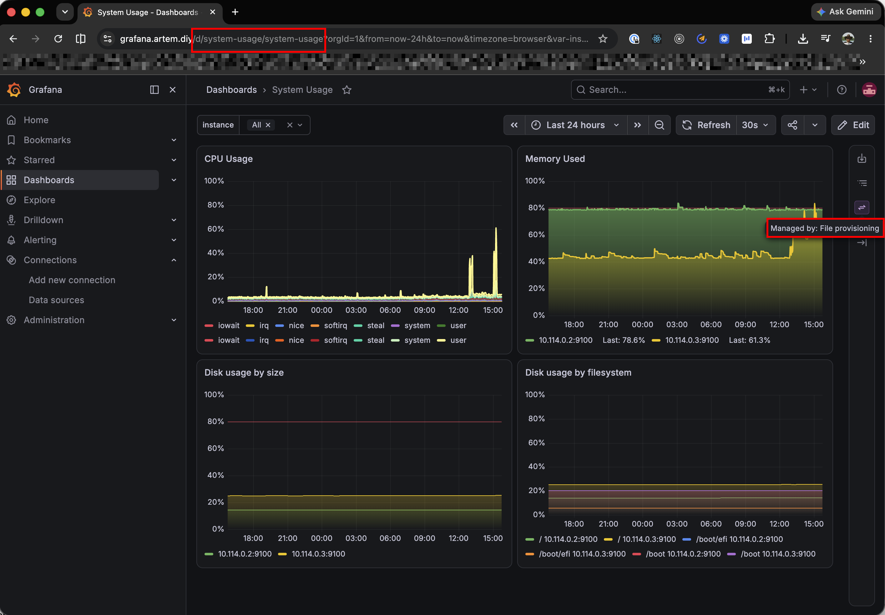
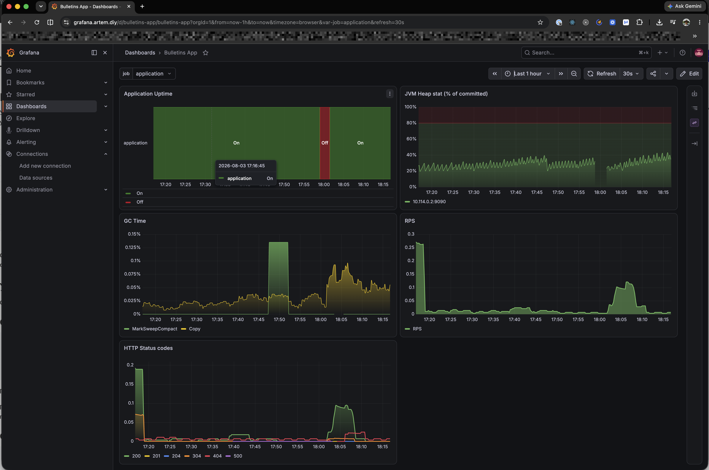

### Hexlet tests and linter status:

[](https://github.com/StepanenkoArtem/devops-engineer-from-scratch-project-318/actions)

## Overview

Two DigitalOcean droplets in a shared VPC:

| Inventory host | Role                             | Public IP         | VPC (private) IP | SSH user |
| -------------- | -------------------------------- | ----------------- | ---------------- | -------- |
| `bulletins`    | application + nginx/TLS          | `165.232.125.175` | `10.114.0.2`     | `devops` |
| `grafana`      | Prometheus + Grafana + nginx/TLS | `165.227.174.50`  | `10.114.0.3`     | `admin`  |

Hosts are addressed in the inventory by **logical alias**, with the IP in `ansible_host` — so a rebuilt droplet only
needs one line changed, and `host_vars/<alias>.yml` never has to be renamed.

Metrics scraping goes over the **private VPC network** — no exporter is reachable from the public internet. SSH is on
port `23332`, key-based, root login and password auth disabled (see bootstrap).

Two public HTTPS endpoints, each nginx + Let's Encrypt on its own host:

| URL                             | What                                     |
| ------------------------------- | ---------------------------------------- |
| **https://bulletins.artem.diy** | the application                          |
| **https://grafana.artem.diy**   | Grafana UI (dashboards) — login required |

## Playbooks & Make targets

| Playbook          | Runs on       | Make target                        | Purpose                                 |
| ----------------- | ------------- | ---------------------------------- | --------------------------------------- |
| `droplets.yml`    | any droplet   | `make droplet HOST=<host>`         | one-shot bootstrap of a fresh droplet   |
| `application.yml` | `application` | `make application IMAGE_TAG=sha-…` | deploy the app (nginx, TLS, container)  |
| `monitoring.yml`  | `monitoring`  | `make monitoring`                  | deploy Prometheus + Grafana (nginx/TLS) |

Install dependencies (Ansible roles + collections + Python deps) once:

```sh
make requirements
```

## Server bootstrap (Ansible)

`ansible/droplets.yml` is a **one-shot** playbook: it takes a fresh droplet (root SSH login open on port 22) and
transitions it to a hardened state — a non-root user with key-based access, SSH moved to a custom port, root and
password authentication disabled, and UFW enabled with a default-deny inbound policy.

Run it **once** per droplet, right after creation/reset, targeting a single host:

```sh
make droplet HOST=application    # or: HOST=monitoring
```

Because the playbook itself closes root@22, re-running it will fail at connection time — that is expected, not a bug.
Ongoing, repeatable configuration lives in the per-role playbooks (`application.yml`, `monitoring.yml`), which connect
as the non-root user on the configured port.

## Application deploy

Deploy a specific image. The play **requires** `image_tag` — an immutable `sha-<commit>` tag (per ADR-0001; there is no
`latest` default, and the play fails fast if the tag is missing):

```sh
make application IMAGE_TAG=sha-<commit>
```

It sets up nginx + a Let's Encrypt TLS certificate and deploys the app container. The vault password file path is set in
`ansible.cfg` (`vault_password_file`), so no `--vault-password-file` flag is needed — just make sure that file exists
locally.

## Monitoring — Prometheus

`ansible/monitoring.yml` deploys Prometheus on the `monitoring` droplet as a Docker container:

- own Docker network `monitoring` (for the future stack — Grafana/Alertmanager);
- **config** as a host bind-mount `/etc/prometheus/prometheus.yml` (rendered from
  `roles/prometheus/templates/prometheus.yml.j2` and **validated with `promtool`** before it is applied — a bad config
  never reaches the running server);
- **data** as a named volume `prometheus-data` → `/prometheus` (survives container recreation);
- published on **`127.0.0.1:9090` only** — Prometheus is internal and stays that way; the public-facing UI is
  **Grafana** (see below). On config change the container is reloaded via `SIGHUP`.

### Scrape targets

All targets are scraped over the **private VPC network**; none is publicly reachable. The list is **generated from the
Ansible inventory** (`prometheus.yml.j2` iterates `groups`/`hostvars`), so adding a droplet to the inventory
automatically adds it as a `node` target — no manual edit of the Prometheus config.

| Job           | Target(s)                              | Path                   | Notes                                |
| ------------- | -------------------------------------- | ---------------------- | ------------------------------------ |
| `node`        | `10.114.0.2:9100` (`role=application`) | `/metrics`             | node_exporter on the app host        |
|               | `10.114.0.3:9100` (`role=monitoring`)  | `/metrics`             | node_exporter on the monitoring host |
| `application` | `10.114.0.2:9090`                      | `/actuator/prometheus` | Spring Boot Actuator over VPC        |

### Access & verification (`up == 1`)

Prometheus listens on loopback only, so reach it through an **SSH tunnel** from your machine:

```sh
ssh -L 9090:localhost:9090 -i ~/.ssh/monitoring -p 23332 admin@165.227.174.50
# then open http://localhost:9090/graph  (or /targets)
```

Verify every target is healthy (`up == 1`) — via the tunnel, or directly on the monitoring host:

```sh
# expect one line per target, all up=1
curl -s 'http://localhost:9090/api/v1/query?query=up' \
  | jq -r '.data.result[] | "\(.metric.job)\t\(.metric.instance)\tup=\(.value[1])"'

# count of healthy targets (expect 3)
curl -s 'http://localhost:9090/api/v1/query?query=count(up==1)' | jq -r '.data.result[0].value[1]'
```

### Alert rules

Alerting rules live in `ansible/roles/prometheus/files/rules/alerts.yml`, copied to `/etc/prometheus/rules/` and loaded
via `rule_files` in the Prometheus config. Currently one rule — `InstanceDown` (`up == 0` for `1m`,
`severity: critical`), visible under `/alerts`. Rules only **evaluate** here; actual notification delivery
(Alertmanager) is a later step.

## Monitoring — Grafana

`ansible/monitoring.yml` also deploys Grafana on the `monitoring` droplet, in the same Docker network as Prometheus.

### Access

**https://grafana.artem.diy** — nginx terminates TLS (Let's Encrypt) and reverse-proxies to Grafana, which is published
on **`127.0.0.1:3000` only**. Grafana is never exposed directly.

| Field    | Value                                                                   |
| -------- | ----------------------------------------------------------------------- |
| URL      | https://grafana.artem.diy                                               |
| User     | `admin` (`grafana_admin_user` in `host_vars/grafana.yml`)               |
| Password | `grafana_admin_password` — **encrypted in Ansible Vault**, never in git |

Read the password locally (the vault password file path is already set in `ansible.cfg`):

```sh
ansible-vault view ansible/group_vars/monitoring/vault.yml
```

The password is passed to the container as `GF_SECURITY_ADMIN_PASSWORD`. Note it only takes effect on the **first**
start, when Grafana creates the admin account — afterwards the source of truth is Grafana's own database in the
`grafana-data` volume. To rotate it: `docker exec grafana grafana cli admin reset-admin-password '<new>'`, or remove the
`grafana-data` volume so the first-start path runs again.

Two more container settings exist because Grafana sits behind a proxy: `GF_SERVER_ROOT_URL` (so redirects and links use
the public HTTPS address instead of `localhost:3000`) and `GF_SECURITY_CSRF_TRUSTED_ORIGINS`.

### Provisioning (config as code)

Nothing is configured by hand in the UI — everything arrives from this repository and is mounted **read-only**:

| What                  | Source in repo                                               | Path on host                             |
| --------------------- | ------------------------------------------------------------ | ---------------------------------------- |
| Prometheus datasource | `roles/grafana/templates/datasources/prometheus.yml.j2`      | `/etc/grafana/provisioning/datasources/` |
| Dashboard provider    | `roles/grafana/templates/dashboard_providers/default.yml.j2` | `/etc/grafana/provisioning/dashboards/`  |
| Dashboard JSON        | `roles/grafana/files/dashboards/*.json`                      | `/etc/grafana/dashboards/`               |

Only Grafana's mutable state (its database, plugins) lives in the named volume `grafana-data` → `/var/lib/grafana`.

The datasource is pinned to a **stable `uid: prometheus`**, not an auto-generated one — so dashboard JSON committed here
keeps resolving its datasource on any freshly built host.

### Dashboards

| Dashboard       | UID             | Scope              | Panels                                                               |
| --------------- | --------------- | ------------------ | -------------------------------------------------------------------- |
| `System Usage`  | `system-usage`  | hosts (node)       | CPU Usage, Memory Used, Disk usage by size, Disk usage by filesystem |
| `Bulletins App` | `bulletins-app` | the app (Actuator) | Application Uptime, JVM Heap, GC Time, RPS, HTTP Status codes        |

Neither dashboard hardcodes a target. `System Usage` is driven by an `instance` variable
(`label_values(up{job=~"node"}, instance)`) and `Bulletins App` by a `job` variable — so both work for any number of
hosts without editing queries.

What each panel is for, where it is not obvious:

| Panel                | Answers                                                                                 |
| -------------------- | --------------------------------------------------------------------------------------- |
| `Application Uptime` | is the target scrapeable at all — a state timeline, green `On` / red `Off`              |
| `JVM Heap`           | memory-leak watch: after each GC the sawtooth should fall back to the **same** baseline |
| `GC Time`            | `rate(jvm_gc_pause_seconds_sum)` = fraction of wall time spent in GC (≲1% healthy)      |
| `RPS`                | total throughput, one line                                                              |
| `HTTP Status codes`  | the response mix by code — this is where a single `500` becomes visible                 |

Two things worth knowing when reading them:

- `Application Uptime` shows `up`, which means "Prometheus could scrape this target", **not** "the app is healthy". A
  JVM stuck in a GC death spiral still answers scrapes, so heap + GC panels are what cover that blind spot.
- Saturation panels (host CPU/memory/disk, JVM heap) use a fixed `0–100%` axis with an `80%` threshold, so the same
  value always looks the same and small wiggles cannot masquerade as spikes. `GC Time` deliberately keeps an auto axis:
  its healthy range is fractions of a percent, which a fixed `0–100%` scale would flatten into a straight line.
- `JVM Heap` divides by the **sum of heap pool maxima**, which the JVM sizes dynamically and which does **not** equal
  `-Xmx` — hence the `(% of committed)` in its title. The denominator can move, so for alerting prefer absolute heap
  bytes against a fixed `-Xmx`.

### Updating a dashboard

Provisioned dashboards are **read-only in the UI** (`allowUiUpdates: false`), which is deliberate: the file in git is
the source of truth, so a UI edit can never be silently reverted by the next deploy. The loop is:

1. Draft/adjust the dashboard in the UI (as a **new**, non-provisioned copy).
2. **Export → Advanced options → Model: `Classic`**, with _Export for sharing externally_ **off**.
3. In the JSON set `"id": null` and a stable `"uid"`.
4. Save it as `ansible/roles/grafana/files/dashboards/<name>.json` and commit.
5. `make monitoring` — the provider re-reads its directory every 10s, so no container restart is needed.
6. Delete the temporary UI copy, so only the provisioned one remains.

Verify it came from the repo: the dashboard URL is `/d/<uid>/…` and its info tooltip reads **"Managed by: File
provisioning"**.

### Screenshots



`System Usage` with `instance = All`, so every panel shows both hosts at once. The URL (`/d/system-usage/…`) and the
"Managed by: File provisioning" badge are the two things worth checking after a deploy — together they prove the
dashboard came from this repository and not from someone's browser session.



`Bulletins App`. The red `Off` band in `Application Uptime` is a deliberate test — the app host was powered off to
confirm the whole chain reacts: the panel turns red, `up` goes to `0`, and the `InstanceDown` rule moves to `firing`. A
dashboard that has never been seen failing has not been verified.

## Observability — metrics

Two metric sources are collected:

- **Host metrics** — `node_exporter` (role `prometheus.prometheus.node_exporter`) on port `9100`, running on **both**
  hosts. It listens on all interfaces but is firewalled by UFW — not reachable from the public internet. The access rule
  differs by who scrapes it: on the **app host** UFW allows `9100` from the VPC (`vpc_net`), so the monitoring node can
  scrape it cross-host; on the **monitoring host** node_exporter is scraped by the local Prometheus container, so `9100`
  is allowed from the Docker bridge range. No basic auth: access is controlled at the network layer.
- **Application metrics** — Spring Boot Actuator exposes `/actuator/prometheus` on management port `9090`, published by
  the container on the app host's **private** address `10.114.0.2:9090` (VPC only, not public). nginx access logs are
  emitted as JSON (`nginx_log_format` with `escape=json`) for downstream processing.

### Mandatory host metrics (node_exporter)

| Area            | Metric                                                                  | Meaning                             |
| --------------- | ----------------------------------------------------------------------- | ----------------------------------- |
| CPU load        | `node_load1` / `node_load5` / `node_load15`                             | load average over 1 / 5 / 15 min    |
| Memory          | `node_memory_MemAvailable_bytes`, `node_memory_MemTotal_bytes`          | available / total RAM               |
| Disk            | `node_filesystem_avail_bytes`, `node_filesystem_size_bytes`             | free / total space per filesystem   |
| Network         | `node_network_receive_bytes_total`, `node_network_transmit_bytes_total` | bytes received / sent per interface |
| Processes       | `node_procs_running`, `node_procs_blocked`                              | runnable / blocked processes        |
| System services | `node_systemd_unit_state`                                               | state of each systemd unit          |

### Application metrics (Actuator / Micrometer)

| Area              | Metric                                                    | Meaning                                    |
| ----------------- | --------------------------------------------------------- | ------------------------------------------ |
| Uptime            | `process_uptime_seconds`                                  | seconds since the app started              |
| HTTP requests     | `http_server_requests_seconds_count` / `_sum` / `_bucket` | request count, total time, latency buckets |
| JVM memory        | `jvm_memory_used_bytes`                                   | JVM heap / non-heap usage                  |
| JVM GC            | `jvm_gc_pause_seconds_count` / `_sum`                     | garbage-collection pauses                  |
| DB pool           | `hikaricp_connections_active`                             | active DB connections                      |
| System (app view) | `system_cpu_usage`, `system_load_average_1m`              | host CPU / load as seen by the app         |

All application metrics carry `application` and `environment` labels (from `management.metrics.tags`).

## Configuration variables

Variables live at the altitude where their value is constant:

- **Per-host** — `ansible/host_vars/<alias>.yml`: `private_address` (the host's VPC IP, used to build scrape targets and
  reach exporters), `domain` (its public hostname — consumed by nginx, certbot and `grafana_root_url` alike),
  `reverse_proxy_port` (the upstream nginx proxies to: `8080` for the app, `3000` for Grafana), and `monitoring_ports`
  (which ports UFW opens to the VPC). Only the IP lives in the inventory, as `ansible_host`.
- **Per-group** — `role` (`group_vars/application` → `application`, `group_vars/monitoring` → `monitoring`; becomes the
  `role` label on `node` metrics), plus per-service nginx vhosts and certbot config (`<group>/nginx.yml`,
  `<group>/certbot.yml`), app-only DB settings, and monitoring-only `monitoring_network` / `prometheus_port`.
- **Shared (both hosts)** — `group_vars/droplets/`: bootstrap (`ssh_port`, `non_root_user_name`, auth toggles),
  `vpc_net` (VPC CIDR for firewall rules), ports (`actuator_port`, `node_exporter_port`, `public_ports`,
  `monitoring_ports`), `docker.yml`, the `accept-new` SSH arg, and secrets in `vault.yml` (Ansible Vault).
- **Connection** — parent group `droplets` with children `application` / `monitoring`; shared `ansible_*` connection
  vars reference the group config (`{{ non_root_user_name }}`, `{{ ssh_port }}`).
