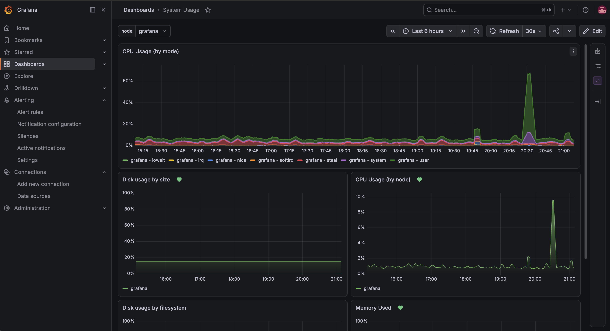
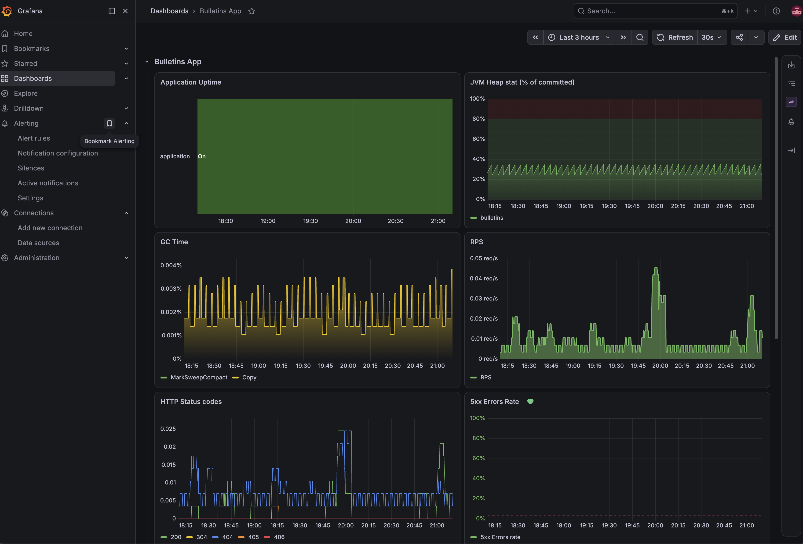
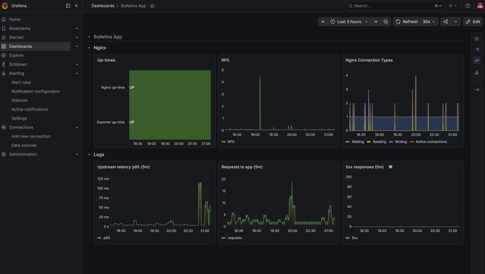
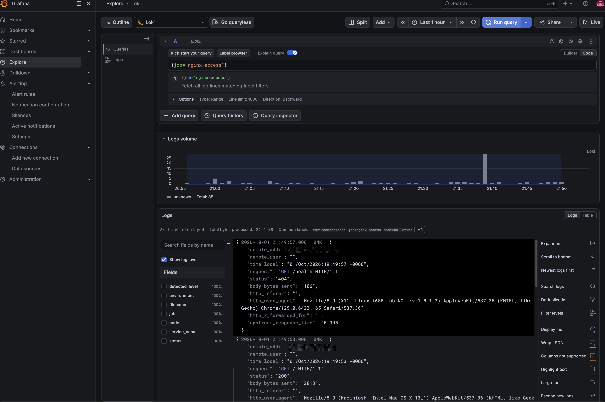
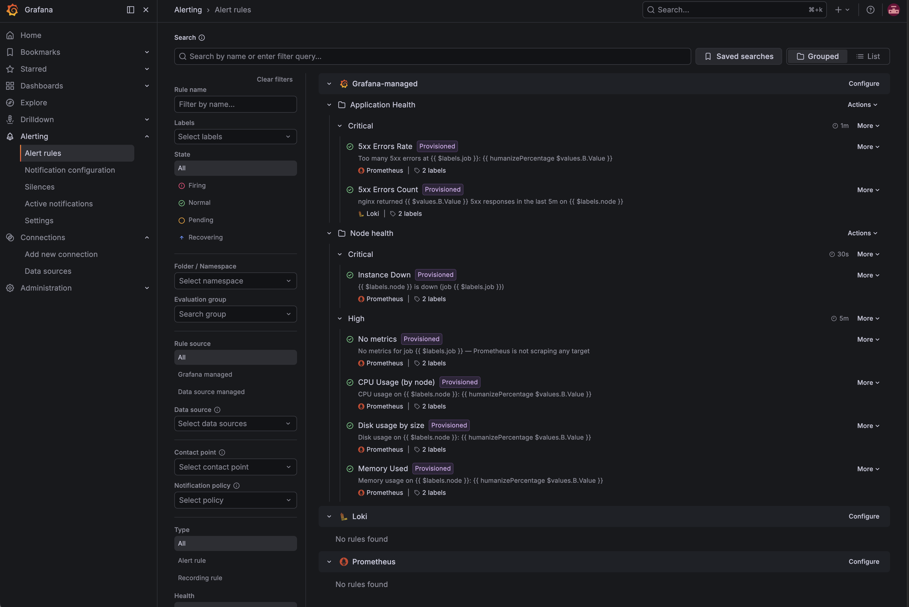
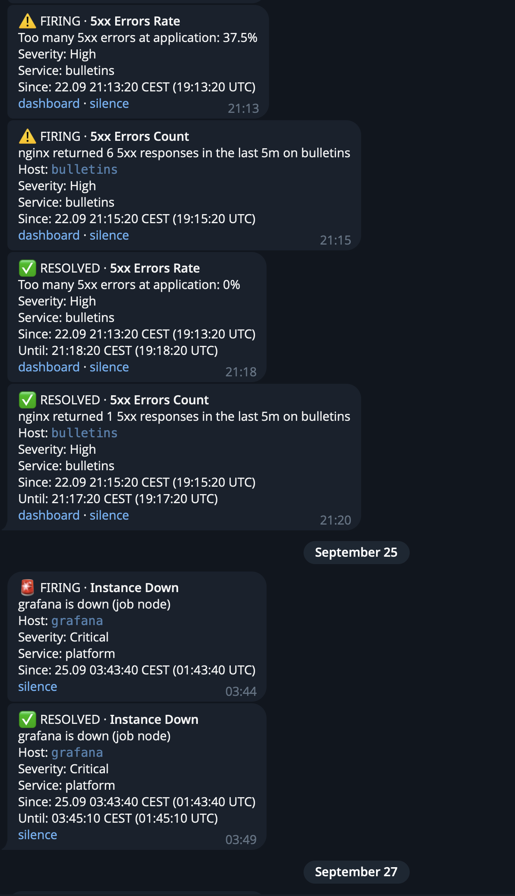

### Hexlet tests and linter status:

[](https://github.com/StepanenkoArtem/devops-engineer-from-scratch-project-318/actions)
[](https://github.com/StepanenkoArtem/devops-engineer-from-scratch-project-318/actions/workflows/checks.yml)

# Bulletins — infrastructure and observability

Ansible code that deploys the [Bulletins application](https://github.com/StepanenkoArtem/project-devops-deploy) and its
monitoring stack onto two DigitalOcean droplets: metrics (Prometheus), logs (Loki), dashboards and alerting (Grafana,
Telegram).

```
                      VPC 10.114.0.0/20
┌─ bulletins ──────────────┐           ┌─ grafana ───────────────────────┐
│ nginx :443 ─> app :8080  │           │ nginx :443 ─> Grafana ──────────┼─> Telegram
│ node_exporter            │           │                 ▲   ▲           │
│ nginx exporter           ├─ scrape ─>│ Prometheus ─────┘   │           │
│ Actuator                 │           │                     │           │
│ Promtail                 ├─ push ───>│ Loki ───────────────┘           │
└──────────────────────────┘           └─────────────────────────────────┘
```

## Addresses, ports, channels

| Inventory host | Public IP         | VPC IP       | Domain                      | SSH             |
| -------------- | ----------------- | ------------ | --------------------------- | --------------- |
| `bulletins`    | `165.232.125.175` | `10.114.0.2` | https://bulletins.artem.diy | `devops@:23332` |
| `grafana`      | `165.227.174.50`  | `10.114.0.3` | https://grafana.artem.diy   | `admin@:23332`  |

Only `80`, `443` and SSH are open to the internet. Everything else listens on loopback or on the VPC address, and UFW
denies the rest. Service ports are defined once, in `ansible/group_vars/droplets/service_ports.yml`.

| Service             | Host        | Port   | Reachable from       |
| ------------------- | ----------- | ------ | -------------------- |
| application         | `bulletins` | `8080` | loopback, via nginx  |
| Spring Actuator     | `bulletins` | `9090` | VPC                  |
| nginx `stub_status` | `bulletins` | `8081` | loopback             |
| nginx exporter      | `bulletins` | `9113` | VPC                  |
| Promtail            | `bulletins` | `9080` | VPC                  |
| node_exporter       | both        | `9100` | VPC / docker network |
| Prometheus          | `grafana`   | `9090` | loopback             |
| Loki                | `grafana`   | `3100` | VPC                  |
| Grafana             | `grafana`   | `3000` | loopback, via nginx  |

- **Alerts** go to Telegram. The bot token and chat id live in Ansible Vault.
- **Grafana** has two accounts: `admin` (password in Vault) and a read-only `mentor` (role `Viewer`), created by the
  playbook. The `mentor` password is sent to the reviewer privately.
- **Prometheus UI** is loopback-only: `ssh -L 9090:localhost:9090 -p 23332 admin@165.227.174.50`.

## Deploy from scratch

Prerequisites: two Ubuntu 24.04 droplets in one VPC with root SSH access by key, DNS `A` records for both domains, a
PostgreSQL database, two S3-compatible buckets (application files, Loki chunks), a Telegram bot, Docker for `make test`.

1. Clone the repository and install the tooling:

   ```sh
   make requirements
   ```

2. SSH keys. Put the public keys into `ansible/public_keys/` and point `ansible_ssh_private_key_file` and
   `public_keys_path` at your pair in `ansible/group_vars/application/main.yml` and
   `ansible/group_vars/monitoring/main.yml`.

3. Inventory. Set your own values:

   | What                               | Where                                       |
   | ---------------------------------- | ------------------------------------------- |
   | public IPs                         | `ansible/inventory.ini`                     |
   | VPC IP and domain of each host     | `ansible/host_vars/<host>.yml`              |
   | VPC CIDR                           | `ansible/group_vars/droplets/main.yml`      |
   | database host, port, name          | `ansible/group_vars/application/main.yml`   |
   | application version and its bucket | `ansible/group_vars/application/deploy.yml` |
   | Loki bucket                        | `ansible/group_vars/monitoring/loki.yml`    |

4. Vault. Write the vault password into `ansible/password` (git-ignored), then create both files with
   `ansible-vault create <file>`:

   | File                                       | Keys                                                                                                                                                              |
   | ------------------------------------------ | ----------------------------------------------------------------------------------------------------------------------------------------------------------------- |
   | `ansible/group_vars/application/vault.yml` | `vault_db_username`, `vault_db_password`, `vault_s3_access_key`, `vault_s3_secret_key`                                                                            |
   | `ansible/group_vars/monitoring/vault.yml`  | `vault_grafana_admin_password`, `vault_grafana_viewer_password`, `vault_tg_bot_token`, `vault_tg_chat_id`, `vault_s3_logs_access_key`, `vault_s3_logs_secret_key` |

5. Bootstrap each droplet once. The playbook creates the deploy user, moves SSH to port `23332`, disables root and
   password login and enables UFW, so a second run fails at connection time by design:

   ```sh
   make droplet HOST=bulletins
   make droplet HOST=grafana
   ```

6. Deploy. The application goes first; the monitoring is deployed only if that succeeded:

   ```sh
   make deploy
   ```

7. Verify:

   ```sh
   make smoke
   ```

`make help` lists every target. `make application-check` and `make monitoring-check` run the same playbooks with
`--check --diff`.

## Checks

| Command      | What it checks                                                                             | Needs        |
| ------------ | ------------------------------------------------------------------------------------------ | ------------ |
| `make lint`  | `ansible-lint` at the `production` profile                                                 | nothing      |
| `make test`  | Molecule: applies the `nginx_exporter` role to a throwaway container, twice, then verifies | Docker       |
| `make smoke` | the live system, from outside and from inside                                              | both servers |

`make lint` and `make test` also run in GitHub Actions on every pull request and on every push to `master`
(`.github/workflows/checks.yml`).

`make smoke` requests the application page, its REST API (`/api/bulletins`, which needs the database) and Grafana's
health endpoint from your machine. Then, on the monitoring host, it checks Prometheus, Loki and that every expected
scrape target is `up`. Every check runs to the end, and the last play, `Smoke verdict`, lists everything that failed in
one message, for example `not 200: application page; down or missing: promtail@bulletins`.

When a target is down the output also shows an `[ERROR] ... Action failed: OK` line after the retries. It only means the
retries ran out; the verdict at the end is what to read.

Manual verification:

- both machines answer: `make smoke`, or open the two domains;
- the application serves static files and REST: `/` and `/api/bulletins`;
- Grafana shows metrics and logs: dashboards `System Usage` and `Bulletins App` (its `Logs` row reads Loki);
- an alert can be triggered by hand, see [Alerting](#alerting).

## Monitoring

### Dashboards

Provisioned from `ansible/roles/grafana/files/dashboards/`, read-only in the UI. To update one, edit a copy in the UI,
export it as JSON (model `Classic`, with the original `uid`), save it over the file in that directory and run:

```sh
make monitoring
```







### Logs

Promtail on the application host ships nginx access and error logs and the application container's output to Loki, which
stores them in a dedicated bucket for 15 days. Streams are labelled `job` (`nginx-access`, `nginx-error`,
`application`), `node` and `environment`.



Promtail is a deliberate choice: the course step names it. It reached end of life on 2026-03-02 and its successor is
Grafana Alloy, so the agent is pinned to `3.6.11`, the last release that ships Promtail binaries. Outside this course
the choice would be Alloy.

### Alerting

Rules are evaluated by Grafana and delivered to Telegram. Everything is provisioned from
`ansible/roles/grafana/files/alerting/`.

| Rule                  | Fires when                                 | For | Severity |
| --------------------- | ------------------------------------------ | --- | -------- |
| `Instance Down`       | any scrape target has `up == 0`            | 1m  | Critical |
| `No metrics`          | the `node` job disappeared entirely        | 1m  | Critical |
| `CPU Usage (by node)` | non-idle CPU above 80%                     | 10m | High     |
| `Memory Used`         | used memory above 85%                      | 10m | High     |
| `Disk usage by size`  | used disk above 80%                        | 5m  | High     |
| `5xx Errors Rate`     | 5xx share of application requests above 3% | 1m  | High     |
| `5xx Errors Count`    | more than 5 nginx 5xx responses in 5 min   | 1m  | High     |



To trigger a test alert without touching the application, stop one exporter and wait about three minutes:

```sh
ssh -p 23332 devops@165.232.125.175 'sudo systemctl stop node_exporter'    # FIRING · Instance Down
ssh -p 23332 devops@165.232.125.175 'sudo systemctl start node_exporter'   # RESOLVED
```



## Application version and rollback

The deployed version is pinned in `ansible/group_vars/application/deploy.yml` as an immutable image tag
(`image_tag: "sha-<commit>"`), never `latest`. Releasing a version is a commit that changes that line.

To deploy another version for one run, a rollback for instance:

```sh
make application IMAGE_TAG=sha-<commit>
```

## Known limitations

- Grafana evaluates the alert rules, so nothing reports Grafana's own death. That needs a check from outside this host.
- Loki's `/ready` has been seen returning `503` for a short while with ingestion and queries still working. `make smoke`
  stays strict on purpose and prints the response body when it happens.
- The bootstrap playbook is one-shot. It closes the root login it connects with.
- The deploy user has passwordless `sudo`.
- Dashboard and alerting files deleted from the repository are not removed from the server.
